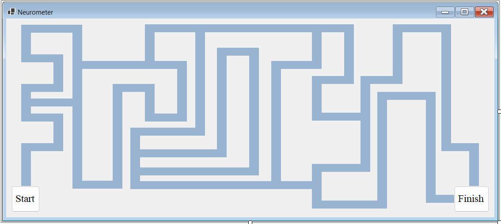

# 🎮 Reflex Game

A desktop reaction and memory game built with **C#** and **Windows Forms**.

The player must quickly react to randomly generated paths before time runs out. This project was developed to practice GUI programming, event handling, and game logic using Windows Forms.

---

## ✨ Features

- ⏱️ Real-time game timer
- 🎯 Random path generation
- 🧠 Memory and reaction speed challenge
- 📊 Score calculation
- 🔄 Restart game
- 🖥️ Windows Forms graphical interface

---

## 📸 Screenshots

### Gameplay



> More screenshots will be added soon.

---

## 🛠️ Technologies

- C#
- .NET Framework
- Windows Forms

---

## 🚀 Getting Started

### Requirements

- Visual Studio 2022 (or later)
- .NET Framework

### Installation

```bash
git clone https://github.com/EhsanOrg009/Neurometer.git
```

Open the solution file (`.sln`) in Visual Studio, build the project, and run it.

---

## 📂 Project Structure

```
Reflex-Game/
│
├── screenshots/
├── Neurometer.sln
├── Neurometer/
└── README.md
```

---

## 🎯 Future Improvements

- Multiple difficulty levels
- High score system
- Sound effects
- Better UI animations
- Keyboard controls
- Save game statistics

---

## 📄 License

This project is licensed under the MIT License.

---

## 👨‍💻 Author

**Ehsan**

- GitHub: https://github.com/EhsanOrg009
